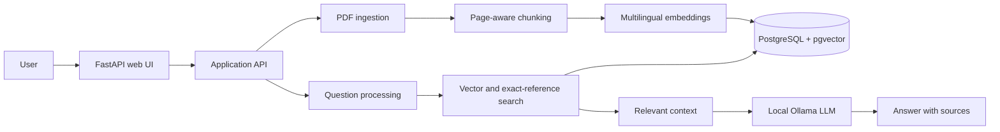

# Corporate Knowledge Assistant

> A local, multilingual RAG assistant for searching and questioning corporate PDF documents.


## Product overview

Corporate Knowledge Assistant turns a collection of internal PDFs into a searchable knowledge base. Users can upload documents, ask questions in different languages, and receive grounded answers with page-level sources.

The project is designed as a focused portfolio example of a production-shaped RAG workflow: document ingestion, vector retrieval, query improvement, answer generation, persistence, and automated tests.

## Project status

The core MVP is implemented and works locally with PostgreSQL, pgvector, and Ollama. The project is still in active development: the current focus is improving reliability, evaluation, and the path from a local portfolio application to a deployable internal tool.

## Highlights

- PDF upload with page-aware text extraction
- Chunking and multilingual embeddings
- PostgreSQL storage with `pgvector` similarity search
- Search within one document or across the full collection
- Query rewriting for multilingual document search
- Priority handling for exact references such as `§ 42g`
- Answers generated by a local Ollama model with source references
- FastAPI web interface and a focused regression test suite

## Architecture



For the complete repository map and module responsibilities, see [Project structure](docs/PROJECT_STRUCTURE.md). The implementation notes are collected in [Project details](docs/PROJECT_DETAILS.md).

## Tech stack

| Area | Technologies |
| --- | --- |
| Backend | Python 3.11, FastAPI, Uvicorn |
| Persistence | PostgreSQL, SQLAlchemy, Alembic, pgvector |
| Retrieval | Sentence Transformers, multilingual embeddings |
| Documents | pypdf, LangChain text splitters |
| Local AI | Ollama |
| Tooling | uv, pytest, Ruff, Docker Compose |

## AI models

The application uses two local models. They are separate: the embedding model creates vectors for document search, while the Ollama model rewrites questions and generates answers.

### Embedding model

- **Model:** `sentence-transformers/paraphrase-multilingual-MiniLM-L12-v2`
- **Source:** [Hugging Face](https://huggingface.co/sentence-transformers/paraphrase-multilingual-MiniLM-L12-v2)
- **Purpose:** multilingual document and question embeddings
- **Vector size:** 384 dimensions, matching the PostgreSQL schema

**Why this model:** it is designed for multilingual semantic similarity, so a question and a relevant passage can match even when they are written in different languages. This is important for the assistant's cross-language search scenario. The 384-dimensional output keeps PostgreSQL and pgvector storage relatively compact while providing a good balance between retrieval quality and processing speed. The model is also directly supported by Sentence Transformers, which keeps local installation and inference simple.

No manual installation is required. After `uv sync`, Sentence Transformers downloads the model automatically from Hugging Face the first time the application imports `app.services.embeddings` or processes a document. Internet access is required for this first download; the model is then reused from the local Hugging Face cache. To download it explicitly before starting the app, run:

```powershell
uv run python -c "from sentence_transformers import SentenceTransformer; SentenceTransformer('paraphrase-multilingual-MiniLM-L12-v2')"
```

### Answer-generation model

- **Model:** `mistral` (the default configured in `app/services/llm.py`)
- **Runtime and source:** [Ollama](https://ollama.com/), downloaded from the Ollama model registry
- **Purpose:** query rewriting and answer generation

**Why `mistral`:** it is a practical general-purpose model for a local RAG assistant. It can perform both query rewriting and concise grounded answer generation, so the project does not need separate models for these steps. Running it through Ollama keeps corporate documents on the local machine, avoids API costs and external service dependencies, and provides a simple, reproducible model interface. The model offers a useful balance of answer quality, response speed, and hardware requirements for a portfolio-scale local deployment.

Install Ollama from the [official Windows download page](https://ollama.com/download/windows), then open a new PowerShell window and download the model:

```powershell
ollama pull mistral
ollama list
```

Ollama Desktop normally starts the local service automatically. If it is not running, start it with `ollama serve` and keep that process open. The application expects the service at `http://localhost:11434/api/generate`.

To use another model supported by Ollama, download it first and set its name in `.env`:

```env
OLLAMA_MODEL=llama3.2
```

The model must be available locally before asking questions. The embedding model must not be changed without also updating the database vector dimension and re-indexing documents.

## Quick start

Before starting the application, install Docker Desktop, `uv`, and Ollama. Download the default LLM with `ollama pull mistral` as described in [AI models](#ai-models). The setup script installs the Python dependencies and starts PostgreSQL, but it does not install Ollama or download models.

### One-click setup on Windows

From the project root, run:

```powershell
setup.bat
```

The script will:

- install Python requirements via `uv`
- create or reset the local `.venv`
- create a default `.env` if it is missing
- start PostgreSQL with Docker Compose
- run Alembic migrations
- show the command to launch the app

### Manual setup

1. Install dependencies:

```bash
uv sync
```

2. Create a `.env` file with your database settings:

```env
POSTGRES_HOST=localhost
POSTGRES_PORT=5433
POSTGRES_DB=rag_db
POSTGRES_USER=rag_user
POSTGRES_PASSWORD=rag_password
POSTGRES_CONNECT_TIMEOUT=5
HF_HUB_DISABLE_TELEMETRY=1
OLLAMA_MODEL=mistral
```

3. Install and download the local AI models as described in [AI models](#ai-models).

4. Start PostgreSQL and the app:

```bash
docker compose up -d
uv run uvicorn app.main:app --reload
```

5. Open the app at:

```text
http://localhost:8000
```

## Testing

Run unit and service-level tests without external services:

```bash
uv run pytest -q tests/test_rag.py tests/test_splitter.py tests/test_processor.py tests/test_pdf.py tests/test_model.py
```

Run the full integration suite after PostgreSQL is running and migrations are applied:

```bash
uv run pytest -q
```

Database connection attempts fail after five seconds by default. Override this with
`POSTGRES_CONNECT_TIMEOUT` when working with a remote database.

## Roadmap

Planned improvements:

- Add authentication and document-level access control for corporate use.
- Move PDF parsing and embedding generation to background jobs with progress reporting.
- Add OCR support for scanned PDFs and improve extraction of tables and complex layouts.
- Introduce a RAG evaluation set with retrieval and answer-quality metrics.
- Add reranking, configurable retrieval parameters, and better handling of long contexts.
- Add health checks, structured observability, CI checks, and a deployment configuration.
- Improve document lifecycle management with metadata, versioning, and re-indexing controls.

## Configuration

- The app expects an Ollama endpoint at `http://localhost:11434/api/generate`.
- PostgreSQL is exposed locally on port `5433` by Docker Compose.
- `OLLAMA_MODEL` and model download details are documented in [AI models](#ai-models).
- A complete database configuration example is included in the manual setup section above.

## Documentation

- [Project structure](docs/PROJECT_STRUCTURE.md): repository tree and responsibility of each module
- [Project details](docs/PROJECT_DETAILS.md): architecture, storage model, and implementation notes

## License

This is proprietary software. The source code may be viewed, but use, copying,
modification, and distribution require prior written permission from the
copyright holder. See the [license terms](LICENSE).