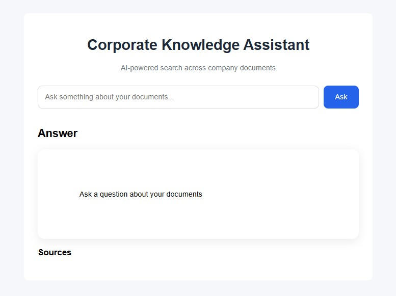

# Corporate Knowledge Assistant

A small RAG-based assistant for searching and questioning company documents.

## What it does

- Uploads PDF documents
- Extracts text and splits it into chunks
- Creates embeddings and stores them in PostgreSQL + pgvector
- Answers questions using retrieved context and an LLM

## Tech stack

- Python 3.11
- FastAPI
- SQLAlchemy + PostgreSQL + pgvector
- Sentence Transformers
- pypdf + langchain text splitters
- uv

## Quick start

1. Install dependencies:

```bash
uv sync
```

2. Create a `.env` file with your database settings:

```env
POSTGRES_HOST=localhost
POSTGRES_PORT=5432
POSTGRES_DB=rag_db
POSTGRES_USER=rag_user
POSTGRES_PASSWORD=rag_password
```

3. Start PostgreSQL and the app:

```bash
docker compose up -d
uv run uvicorn app.main:app --reload
```

4. Open the app at:

```text
http://localhost:8000
```

## Testing

Run the main regression suite:

```bash
uv run pytest -q tests/test_rag.py tests/test_api.py tests/test_splitter.py tests/test_processor.py tests/test_ingestion.py tests/test_pdf.py tests/test_search.py tests/test_connection.py tests/test_db.py tests/test_llm.py tests/test_model.py
```

## Notes

- The app expects an LLM endpoint at `http://localhost:11434/api/generate` for answer generation.
- More detailed project context is available in [docs/PROJECT_DETAILS.md](docs/PROJECT_DETAILS.md).

### Chat Interface

