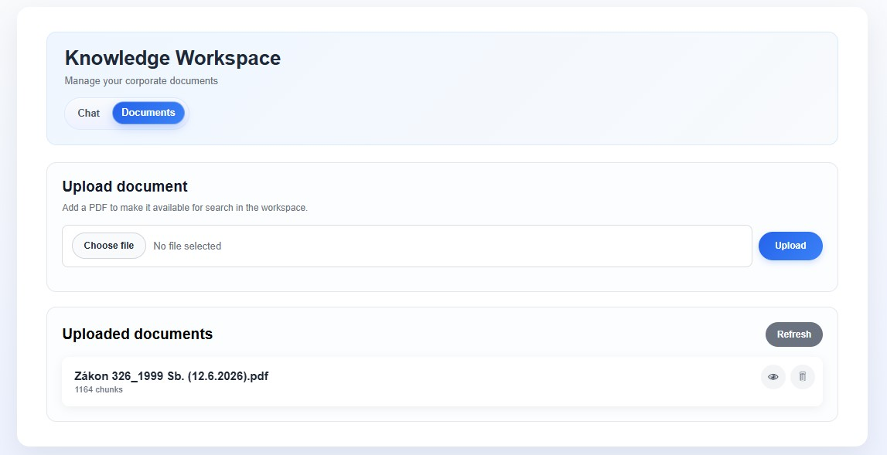
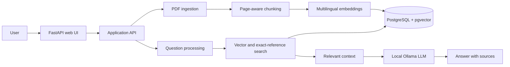

# Corporate Knowledge Assistant




## Highlights

- PDF upload with page-aware text extraction
- Chunking and multilingual embeddings
- PostgreSQL storage with `pgvector` similarity search
- Search within one document or across the full collection
- Query rewriting for multilingual document search
- Priority handling for exact references such as `§ 42g`
- Answers generated by a local Ollama model with source references
- FastAPI web interface and a focused regression test suite

## Architecture

The flow is simple:

1. User uploads a PDF document.
2. The document is parsed and split into text chunks.
3. Each chunk is embedded and stored in PostgreSQL with pgvector.
4. A user question is embedded and matched against stored chunks.
5. The most relevant chunks are passed to an LLM to produce an answer with source references.



## Tech stack

| Area | Technologies |
| --- | --- |
| Backend | Python 3.11, FastAPI, Uvicorn |
| Persistence | PostgreSQL, SQLAlchemy, Alembic, pgvector |
| Retrieval | Sentence Transformers, multilingual embeddings |
| Documents | pypdf, LangChain text splitters |
| Local AI | Ollama |
| Tooling | uv, pytest, Ruff, Docker Compose |

## Main components

- FastAPI app for the web API and UI routes
- Document ingestion pipeline for PDF processing
- Embedding and vector search layer
- LLM integration for answer generation
- SQLAlchemy models and Alembic migrations for persistence

## Models and local installation

The project uses two different local AI models:

### Embeddings

The embedding model is `sentence-transformers/paraphrase-multilingual-MiniLM-L12-v2`. It supports multilingual semantic search and produces vectors with 384 dimensions, which matches the `documents.embedding` column and its pgvector index. The model is published on [Hugging Face](https://huggingface.co/sentence-transformers/paraphrase-multilingual-MiniLM-L12-v2).

The model was selected because the application must search corporate documents across languages. It maps semantically related text into a shared multilingual vector space, which allows a question in one language to retrieve a relevant passage in another. Its 384-dimensional vectors reduce storage and search cost compared with larger embedding models, while its direct Sentence Transformers integration makes local inference straightforward. This is a practical quality, speed, and resource trade-off for the current MVP.

It is installed as part of the Python dependency `sentence-transformers`. The first import of `app.services.embeddings` downloads the model automatically from Hugging Face and stores it in the local Hugging Face cache. To pre-download it manually after `uv sync`, run:

```powershell
uv run python -c "from sentence_transformers import SentenceTransformer; SentenceTransformer('paraphrase-multilingual-MiniLM-L12-v2')"
```

### Answer-generation LLM

Question rewriting and answer generation use the `mistral` model through [Ollama](https://ollama.com/). Install Ollama using the [official Windows installer](https://ollama.com/download/windows), then download the model:

`mistral` was chosen as a general-purpose local model that can handle both stages of the RAG workflow: rewriting multilingual search queries and generating concise answers from retrieved context. Ollama provides a stable local HTTP interface and keeps document content on the user's machine, with no per-request API cost. For this portfolio MVP, the model provides a reasonable balance between response quality, latency, and hardware requirements; a larger or specialized model can be configured later through `OLLAMA_MODEL` if needed.

```powershell
ollama pull mistral
```

Ollama must be running locally on `http://localhost:11434`. Ollama Desktop starts the service automatically in the usual installation; otherwise run `ollama serve`. The application reads the model name from `OLLAMA_MODEL` and uses `mistral` when the variable is not set. For example:

```env
OLLAMA_MODEL=mistral
```

An alternative Ollama model can be used by pulling it first and changing `OLLAMA_MODEL`. Changing the embedding model requires updating the vector dimension in the database schema and re-indexing existing documents.

## Storage model

The core table stores document chunks together with their embeddings:

- filename
- page
- chunk_id
- content
- embedding

## Notes

The current implementation focuses on a simple, testable MVP. It is intentionally compact and suitable for local development and portfolio demonstration.

## Testing

Run unit and service-level tests without external services:

```bash
uv run pytest -q tests/test_rag.py tests/test_splitter.py tests/test_processor.py tests/test_pdf.py tests/test_model.py
```

Run the full integration suite after PostgreSQL is running and migrations are applied:

```bash
uv run pytest -q
```

Database connection attempts fail after five seconds by default. Override this with `POSTGRES_CONNECT_TIMEOUT` when working with a remote database.

## Roadmap

- Add authentication and document-level access control for corporate use.
- Move PDF parsing and embedding generation to background jobs with progress reporting.
- Add OCR support for scanned PDFs and improve extraction of tables and complex layouts.
- Introduce a RAG evaluation set with retrieval and answer-quality metrics.
- Add reranking, configurable retrieval parameters, and better handling of long contexts.
- Add health checks, structured observability, CI checks, and a deployment configuration.
- Improve document lifecycle management with metadata, versioning, and re-indexing controls.

## Configuration

- The app expects an Ollama endpoint at `http://localhost:11434/api/generate`.
- PostgreSQL is exposed locally on port `5433` by Docker Compose.
- `OLLAMA_MODEL` controls the local answer-generation model.
- Database settings are configured through `.env`; the installation example is in the root README.

